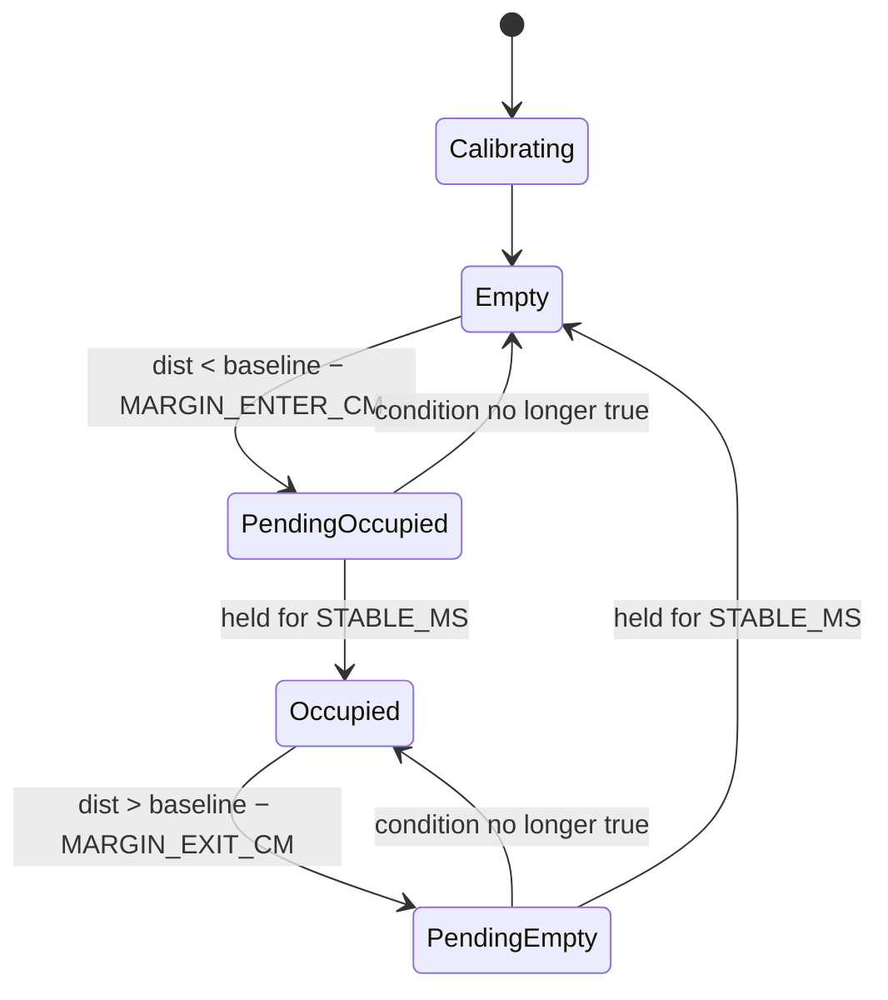

# 06 — ESP32 Firmware

## Environment

| Item | Value |
|---|---|
| Board | ESP32 DevKit V1 → Arduino board "ESP32 Dev Module" |
| IDE | Arduino IDE 2.3.10 [R]. All three members use Arduino IDE [R, 2026-09-21] |
| ESP32 Arduino core | [TODO] record installed version. The firmware uses `ADC_11db`; `ADC_ATTEN_DB_12` did not compile on a member's install [V: compiler output, 2026-09-21] |
| External libraries | None |
| USB driver | Silicon Labs CP210x VCP |

## Source layout

| Path | Purpose |
|---|---|
| `ESP32/ESP32.ino` | Main firmware. Sketch folder is `ESP32/`, so Arduino IDE opens it directly |
| `ESP32/parameters.h` | All tunable settings — the only file to edit for tuning |
| `ESP32/SECRETS.example.h` | Credential template. Copy to `SECRETS.h` (git-ignored) from the WiFi stage on |
| `Unit Tests/ir_sensor_check/` | Standalone sensor bring-up sketch |

## Runtime behaviour

1. **Boot:** configure ADC attenuation (full range up to ~3.1 V) and LED pins, print the active parameters.
2. **Calibration (3 s delay, then ~1 s per seat):** fills the sample window twice, takes the median as the empty-seat **baseline**, and warns if noise is high or the baseline is outside 20–75 cm.
3. **Loop (non-blocking):** every 40 ms, one sample per seat enters a ring buffer; the filtered distance is the median of the last 11 samples (440 ms of history). The state machine below runs on every sample. A status line prints every 500 ms.

Sampling at 40 ms matches the sensor's own ~38 ms update period, so each sample in the window is an independent reading.

## State machine (per seat)



The decision is **relative to the calibrated baseline**, not an absolute distance, so it tolerates per-unit offsets from the datasheet formula and different mounting heights. The two margins create a dead band (hysteresis) where the state cannot flip, and `STABLE_MS` stops single spikes from producing events.

## Configuration parameters (`ESP32/parameters.h`)

| Name | Default | Unit | Effect / guidance |
|---|---|---|---|
| `NUM_SEATS` | 2 | — | Seats handled. Compile fails if the pin arrays are shorter |
| `SENSOR_PINS` | {34, 35} | GPIO | ADC1 pins only |
| `LED_PINS` | {2, 4} | GPIO | GPIO2 = on-board LED |
| `SAMPLE_INTERVAL_MS` | 40 | ms | Keep ≈ sensor update period |
| `MEDIAN_WINDOW` | 11 | samples | Odd. Raise (e.g. 15) only if isolated false events appear. Larger = slower response |
| `PRINT_INTERVAL_MS` | 500 | ms | Status line period |
| `MARGIN_ENTER_CM` | 20 | cm | ≈ half of the measured empty/occupied gap (~40 cm) |
| `MARGIN_EXIT_CM` | 12 | cm | < `MARGIN_ENTER_CM`; the difference is the hysteresis band |
| `STABLE_MS` | 1000 | ms | Confirmation time for a state change |
| `DIST_COEFF`, `DIST_EXP` | 29.988, −1.173 | — | Voltage→distance fit from the course datasheet slide |
| `V_MIN_VALID` | 0.35 | V | Below: no reflection, reported as `DIST_MAX_CM` |
| `DIST_MAX_CM` / `DIST_MIN_CM` | 90 / 10 | cm | Clamps. Below ~8 cm the sensor curve is non-monotonic |
| `NOISE_WARN_MV` | 150 | mV | Calibration warning threshold |
| `BASELINE_MIN_CM` / `BASELINE_MAX_CM` | 20 / 75 | cm | Calibration sanity range |

Note: `MEDIAN_WINDOW` counts samples and `MARGIN_*` are centimetres — they are unrelated even if the numbers look similar. The window is set by how noisy the sensor is; the margins by how far apart the two states are.

## Serial interface (115200 baud)

| Input | Action |
|---|---|
| `c` | Recalibrate (all seats must be empty) |
| `d` | Toggle raw millivolt output |

Log lines:

```
CAL seat=0 baseline=65.2cm mv=512 noise=48mV
S0 dist= 64.8cm base= 65.2cm noise= 52mV EMPTY
EVENT seat=0 state=OCCUPIED dist=27.3cm
```

A `?` after the state means a change is pending confirmation. The values above are illustrative only.

These lines are parsed by `PC_software/seat_live.py`. The exact formats are specified in [08_COMMUNICATION_AND_DATA.md](08_COMMUNICATION_AND_DATA.md): **changing any `Serial.printf` format requires updating the PC software.**

## Build and flash

1. Arduino IDE → File → Preferences → Additional boards manager URLs: `https://espressif.github.io/arduino-esp32/package_esp32_index.json` (if the esp32 package is not already listed).
2. Boards Manager → install **esp32 by Espressif Systems**.
3. Open `ESP32/ESP32.ino`, select board **ESP32 Dev Module** and the CP210x COM port, upload.
4. Serial Monitor at **115200**.

Command-line alternative: `arduino-cli compile --fqbn esp32:esp32:esp32 ESP32` then `arduino-cli upload -p <PORT> --fqbn esp32:esp32:esp32 ESP32`.

## Compiled binary

`ESP32/compiled_program.bin` must be exported from the same source that was tested:

1. Arduino IDE → open `ESP32/ESP32.ino` → Sketch → Export Compiled Binary.
2. In the new `ESP32/build/` folder, take `ESP32.ino.merged.bin` if present (flash at address `0x0`), otherwise `ESP32.ino.bin` (flash at `0x10000`).
3. Copy it to `ESP32/compiled_program.bin`. The `build/` folder is git-ignored.
4. [TODO] record here which file was used and the core version.

Flash without Arduino IDE (`pip install esptool`):
`esptool.py --chip esp32 --port <PORT> write_flash 0x0 compiled_program.bin` (`0x10000` for the non-merged file).

Re-export after every change to `ESP32.ino` or `parameters.h`.

## Known limitations

- Thresholds are compile-time constants. NFR-002 (settings without recompiling) is not met yet.
- Recalibration needs a serial connection. Planned: a physical button or web UI.
- No network code yet.
